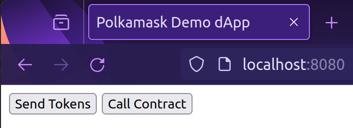
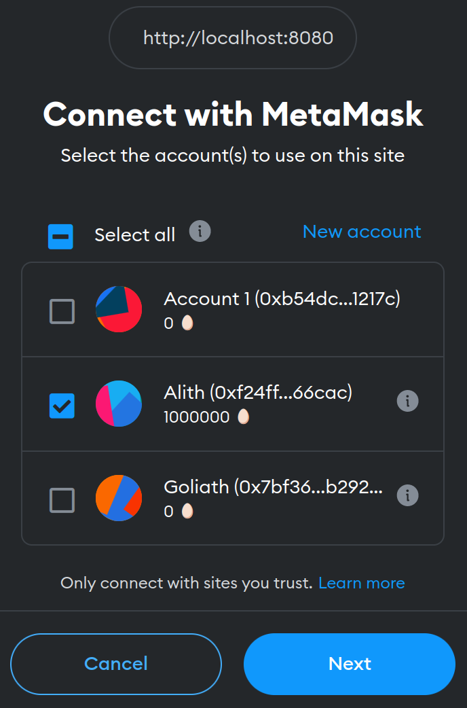
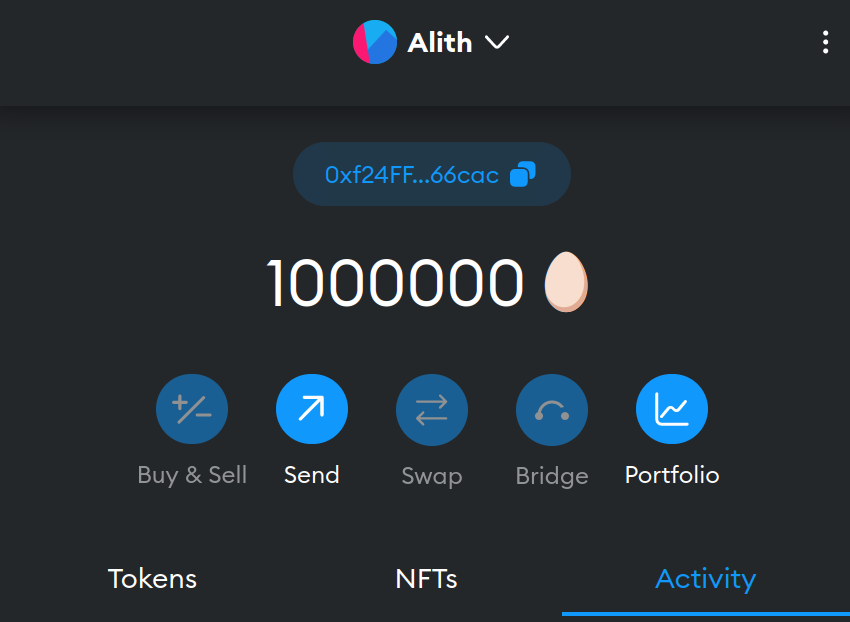
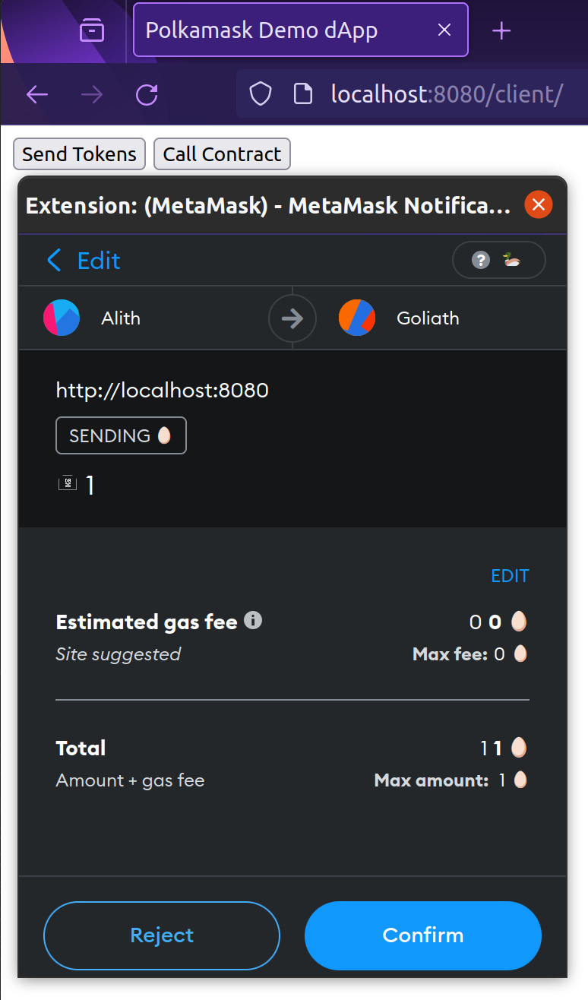
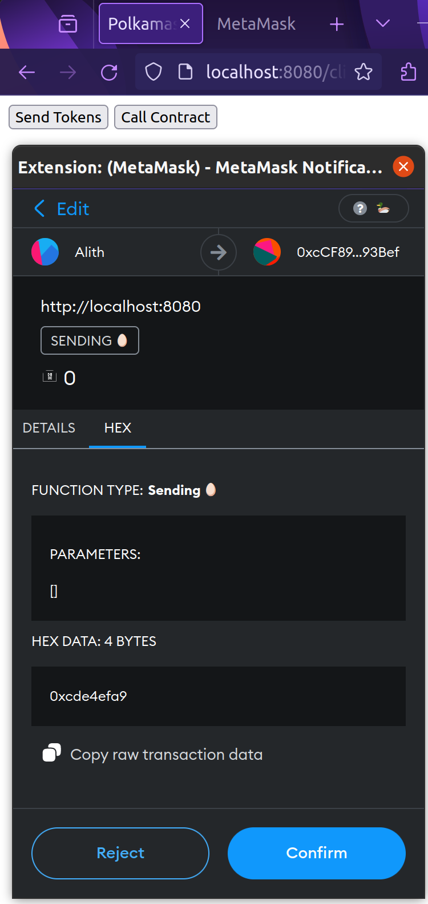
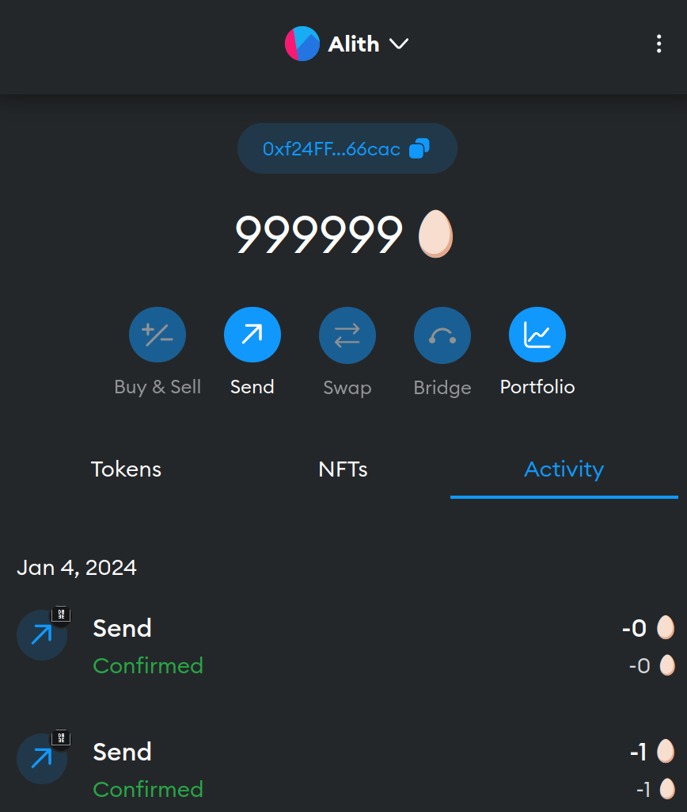

> [!WARNING]
> This is a **Proof Of Concept**. It works, but not (*yet*) intended for production use!!

<div align="center">
    
</div>

# The Polka🎭Mask

This project is an **experimental** add-on to Polkadot SDK's [pallet-contracts](https://github.com/paritytech/polkadot-sdk/tree/master/substrate/frame/contracts) to make it Ethereum RPC -compatible.

> [!TIP]
> **In a nutshell**, it allows your parachain users to **call <a href="https://use.ink/" target="_blank">_ink!_</a> smart contracts via <a href="https://metamask.io/" target="_blank">_MetaMask_**</a>. 

## Quickstart 

Start the Polkamask development node: 

```bash
cargo run -- --dev
```

Open your MetaMask and add a new network:

+ **Network name**: Duck 🦆 
+ **New RPC URL**: http://localhost:9944
+ **Chain ID**: 42
+ **Currency symbol**: 🥚

Also import add the *well-known* development accounts: 

- *Alith*: 

   + AccountId: `0xf24FF3a9CF04c71Dbc94D0b566f7A27B94566cac`
   + Private Key: `0x5fb92d6e98884f76de468fa3f6278f8807c48bebc13595d45af5bdc4da702133`

- *Goliath*: 

   + AccountId: `0x7BF369283338E12C90514468aa3868A551AB2929`
   + Private Key: `0x96b8a38e12e1a31dee1eab2fffdf9d9990045f5b37e44d8cc27766ef294acf18`

> [!CAUTION]
> It is **highly recommended** to use a separate MetaMask instance for this (e.g. in a dedicated <a href="https://support.mozilla.org/en-US/kb/profiles-where-firefox-stores-user-data" target="_blank">browser profile</a>), not to mix the development accounts (whose private keys **are compromised** by design) with your real money-holding accounts. 

**That's it!** You should right away be able to communicate with the Duck 🦆 chain using your MetaMask. Let's see it in action, as described in the following section. 

## Demo 🧐

Our little demo consists of the three basic actions we complete on our *Substrate*-based 🦆-network using *MetaMask*:

1. **👛 Transfer tokens**.  
   With the MetaMask UI controls solely.

   This is the simplest action as we already have everything set up to do this. 
   Once launched the Polkamask node with `cargo run -- --dev`, just open your MetaMask and make sure it is connected to our 🦆 network. You should see *Alith* account holding `10000000 🥚`. Go ahead and send some amount of eggs to *Goliath* or any other account you'd like to (set gas limit to `21000` as requested by MetaMask). 

2. **⚡ dApp (simple): tokens transfer**.  
   Via *web3js*-based dApp used with MetaMask for signing transactions.
   
3. **🚀 dApp (advanced): ink! + MetaMask**.  
   Call *ink!* smart contract via *web3js*-based dApp using  *MetaMask* for signing transactions.

For the actions 2,3 we have a simple [dApp](/dapp) which consists of a static [web page](/dapp/index.html) and of course our [**ink!** contract](/dapp/contracts/flipper.ink/). This needs a bit of preparatory job to be done to set things up first.


### Prepare

Our 🦆-chain has _pallet-contracts_ on board and at the same time works with _Ethereum_ 20-bytes _Account_ format. The latter fact is required so that our node can understand *MetaMask*-signed transactions. But for the existing _ink!_ contracts tooling this is an unusual setting, as they're expected to work with 32-bytes long _Accounts_.  

For this reason, to work with our *ink!* contracts on this chain, we use a fork of _cargo-contract_ tool which speaks with our node the same language! Run this command to install it: 

``` bash
cargo install --git https://github.com/agryaznov/cargo-contract --branch polkamask --force
```

### Set Up 

#### Build contract(s)

**ink! contract**

```bash 
cd dapp/contracts/flipper.ink
cargo contract build 
```

**Solidity contract (optional)**

> [!NOTE]
> In order to get Ethereum _web3js_ library work with our *ink!* contract, we **gotta make it believe it deals with an Ethereum contract**. 
> For that, we need to generate a metadata for our contract in the proper format. For the purposes of our PoC demo, we uploaded a ready-to use [JSON file](dapp/contracts/flipper.sol/build/contracts/) with that metadata. Though if you'd like you can install <a href="https://trufflesuite.com/" target="_blank">truffle</a> tool and build it yourself as described below.
>
> ❗**Keep in mind** that in the future this step is intended to be done by existing ink! tooling (e.g. _cargo-contract_).


``` bash
cd dapp/contracts/flipper.ink
truffle build
```

#### Deploy contract

Make sure you've started the _polkamask-node_:

```bash
cargo run -- --dev
```

Then deploy the contract: 

```bash 
cd dapp/contracts/flipper.ink
cargo contract instantiate -s 0x5fb92d6e98884f76de468fa3f6278f8807c48bebc13595d45af5bdc4da702133 --args=false -x
```

(Notice we use *Alith's* private key here for transaction signing).

You should get the contract's code hash and address on the successful competion of the transaction: 

``` bash
 Code hash 0xae41a6b1cfafb8c2170ee6b9810e35c8ca442fcc54a773a8ac34607dbc3b35a0
 Contract 0xcCF89DAfeF6634fd058F356F8f2650eae2c93Bef
```

#### Prepare dApp

``` bash
cd dapp/client
npm i
npm start
```

For the demo purposes we made our dApp dead simple. You might need to put actual deployed contract address here to its source code (needed only of you changed the contract source): 

<details>
https://github.com/agryaznov/polkamask/blob/f4e2624c0cfce0d77fb9eb980cb9ad44671ee1d4/dapp/client/src/index.js#L20-L24
</details>


### ⭐ Run! 

Once you have your polkamask-node and dApp started, open your browser at http://localhost:8080/client/ to load our dApp: 



You should see the MetaMask pop-up asking for permissions. Allow it to use _Alith_ account on this site:




Click on MetaMask icon and make sure it's connected to our Duck chain. You should see *Alith's* balance in eggs:




#### Making 2. **⚡ dApp (simple): tokens transfer**:  

Now go ahead and click on `Send Tokens` button! 



Confirm the transaction... and, in a moment later you should see one egg has been sent to Goliath!


Cool, we have just used an web3js dApp to send some eggs between accounts on our Duck network!  
Keep going, in few momenta we'll call our ink! contract with it!

#### Making 3. **🚀 dApp (advanced): ink! + MetaMask**.  


First, check the current state of our contract with this command:

``` bash
cargo contract call -s 0x5fb92d6e98884f76de468fa3f6278f8807c48bebc13595d45af5bdc4da702133 --contract 0xcCF89DAfeF6634fd058F356F8f2650eae2c93Bef --message get
```

We see that current Flipper's state is `false`:

``` bash
 Result Success!
 Reverted false
 Data Ok(false)
```

<details>
<summary>
We can also do the same check via PolkadotJS Apps as usual: 
</summary>

</details>


And finally, the moment of truth has come. 🥁 Can we **really** call our **ink!** contract from **MetaMask**? Well, let's see. 

Open our [dApp page](http://localhost:8080/client/) again. Click on the `Call Contract` button. 



Click on `Confirm` and wait until your transaction made it to the block: 



Now check the state again with *cargo-contract*, and... 

``` bash
 Result Success!
 Reverted false
 Data Ok(true)
```

🎉 **Congratulations, you have just called your *ink!* contract via *MetaMask*, and it just worked!**

> [!TIP]
> 💡 Looks simple, right? 
> 
> 🧠 Under the hood though, that was an amusing journey your transaction had made through your node's exposed custom Ethereum RPC, then it got transformed through your network's Runtime RPC, got into the transaction pool as a pallet-polkamask extrinsic, then got into the block and processes by that pallet which understood it's a transaction for pallet-contracts, transformed it again to the corresponding dispatchable which finally made it to your contract!
>
> Whoa, what a long way, right? But let's put the details off for now and just enjoy the moment!  
> The design technicalities are to be explained in the polkamask docs, stay tuned!

## Project Goals `TBD: move`

- PoC stage target is to be able to interact with a deployed ink! example contract through MetaMask.
- Prototype stage target is to provide means for making the same thing possible with any ink! contract (which would still require some work to be done by Dapp developer).

## Plan & Status `TBD: move`


1. [x] Basic mocked Eth RPC + boilerplate node which you can connect your MetaMask (MM) to.
2. [x] Ethereum block emulation, to make MM satisfied with the `eth_getBlockByNumber()` response.  
   Frontier's pallet_ethereum constructs Ethereum block in the [on_finalize](https://github.com/paritytech/frontier/blob/22aaafe089218f6cee625898fff7b953cc793228/frame/ethereum/src/lib.rs#L206) hook, it calls the [store_block](https://github.com/paritytech/frontier/blob/22aaafe089218f6cee625898fff7b953cc793228/frame/ethereum/src/lib.rs#L404) fn which basically **composes** an Ethereum block and **stores** it to the [CurrentBlock](https://github.com/paritytech/frontier/blob/22aaafe089218f6cee625898fff7b953cc793228/frame/ethereum/src/lib.rs#L327) storage.
   The validation\execuction of this block's txs happens in [on_initialize()](https://github.com/paritytech/frontier/blob/22aaafe089218f6cee625898fff7b953cc793228/frame/ethereum/src/lib.rs#L230) hook. That is, the execution of the Eth block happens in the __next_ Substrate block!

   For our purposes hopefully such a hassle woudn't be needed, probably just emulating some Eth block data "on the fly" would be enough. 
   
3. [x] Address conversion and Signing logic.  
   This seems to be simple at first glance, as this is already done in Frontier: see their [two approaches](https://github.com/paritytech/frontier/blob/master/docs/accounts.md) to account convertion.

   First approach is to just truncate first 20 bytes of Substrate address to get Eth address. Here the user has his Substrate account private key, but has no corresponding Eth account private key to be imported into MetaMask. This makes the whole thing unusable.

   Second approach is to set account and signature types for our runtime to be Ethereum-flavored, like it's done in the Frontier template node runtime:

   + `fp_account::EthereumSignature` [is set](https://github.com/paritytech/frontier/blob/0e487900e862bc3519014c1dbef800f200a00f6f/template/runtime/src/lib.rs#L70) to be the Signature type,
   + which also [sets](https://github.com/paritytech/frontier/blob/0e487900e862bc3519014c1dbef800f200a00f6f/template/runtime/src/lib.rs#L74) `fp_account::AccountId20` as the `frame_system::pallet::Config::AccountId`.

   Taken the fact that the whole point of the current PoC is to make experience of communicating with pallet_contracts through Eth RPC seamless from user perspective, we take the second approach here.
   Which also solves the signature verification issue: we use [`sp_io::crypto::secp256k1_ecdsa_recover`](https://github.com/paritytech/frontier/blob/0e487900e862bc3519014c1dbef800f200a00f6f/primitives/account/src/lib.rs#L162) for Verify trait implementation for EthereumSignature, just like it's done in the `fp_account` crate.

4. [x] Call input encoding/decoding logic.  
   Bytes passed to the `eth_sendRawTransaction()` PRC method can be decoded as `EIP1559Transaction` as shown in [this example](docs/transfer_example.md). So the main thing here is to properly encode/decode the "input" data which goes with the call. This is some logic to be implemented by the Dapp developer: Encoding at the UI side (JS code of the Dapp), Decoding within the contract itself. We can provide some means for helping developers with it on the language level, i.e. in ink!. 

5. [x] Add Eth RPC -originated call runner to `pallet_contracts`,  
   
   It will
   
   - decode the call to `EIP1559Transaction`, 
   - pass the call within pallet-contracts as usual (via `bare_call()`, which also transferres the balance value specified with the call).

## Useful Stuff 

- The [table](docs/mapping.md) with all RPC methods needed and their description.
- Collection of *curl* composed [request templates](docs/rpc_requests.md) to Ethereum RPC exposed by Polkamask node. 
