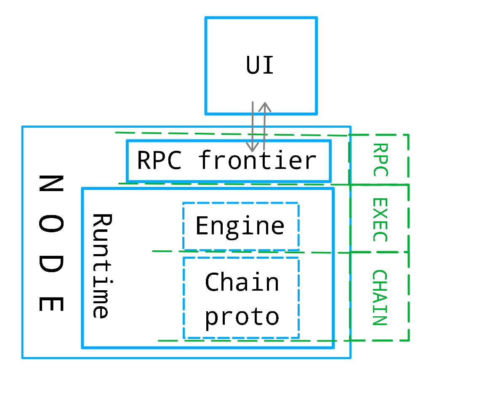
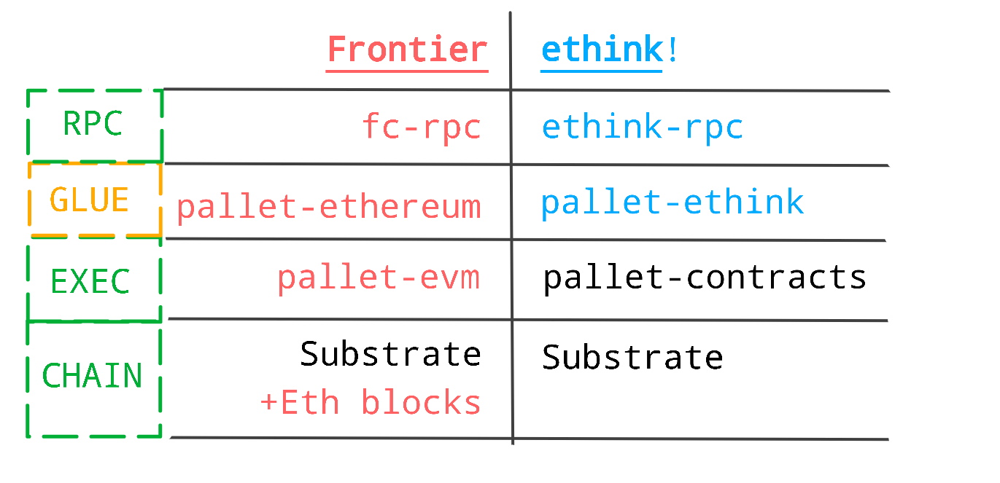

## Compatibility Decoded

Consider a typical dapp tech stack:

    

Simply put, there are the following layers of it:

-   UI built with web3js libraries,

    which speaks to a node via its RPC;

-   `RPC` exposed by a chain node,

    which speaks to node's runtime via its API;

-   `EXEC` Contracts execution engine,

    implemented as a runtime module;

-   `CHAIN` protocol logic,

    implemented in other runtime modules.

When we want to port an Ethereum dapp to our Substrate-based chain, we need to make sure that:

1.  We expose the RPC endpoint which speaks to the UI in compliance with the Ethereum RPC [spec](https://ethereum.github.io/execution-apis/api-documentation/).
2.  On the Execution layer, this implies that our engine should allow contracts to implement the same business logic as in EVM contracts,
    while keeping the same calling conventions between caller and callee (more on that in the next section).
3.  Aside from input and output of the contract being called, dapp might rely on the underlying chain protocol data,
    such as block and transaction data, gas prices, storage state, etc.

    For our RPC to provide such data, our runtime should have logic for translating Substrate chain data to Ethereum chain data.
    
    
## High-level Design

In a nutshell, _ethink!_ is like _Frontier_, but for _pallet-contracts_ instead of _pallet-evm_.

Here is the simplified (non-exhaustive) components map to the compatibility layers introduced in the beginning of this post:

    

There are 3 main pieces of it:

-   `RPC` The RPC "frontier", exposing the RPC endpoint which looks just like a normal Ethereum RPC.

    Its function is to accept requests and decode them, then call an appropriate method of the API exposed by our Substrate runtime, and response back to the caller.
    By adding this piece to our node, we make it look like an Ethereum node to the caller, which is normally a dapp's frontend.

-   `GLUE` The Runtime of our node, which provides special methods in its exposed API, gets a call from the RPC "frontier" and routes the call further.

    Some of them, like e.g. account balance checks or contract "dry-run" calls, does not bring any state changes. For such cases it just calls the corresponding pallet API method (like `pallet_balances::free_balance()`).

    For the ones that do change state (called _transactions_ in Ethereum and _extrinsics_ in Polkadot), the mechanics is as follows. The incoming Ethereum transaction data is being wrapped into [UncheckedExtrinsic](https://paritytech.github.io/polkadot-sdk/master/sp_runtime/generic/struct.UncheckedExtrinsic.html) with the call to `pallet-ethink::transact(),` which decodes passed in Ethereum transaction, and routes the call further (based on type of the destination account) to a specific destination pallet. Specifically, for the calls addressed to an account which belongs to a contract, the destination module is _pallet-contracts_. If the callee address is a user account, the destination module is _pallet-balances_, as the call is considered to be just a balance transfer. (This logic is inherited from Ethereum).

    The wrapper extrinsic is being put to the transaction pool. Just like any other extrinsic, it has its special logic for checking its validity. Upon such validation, the Ethereum signature is being checked and the caller account is being extracted from it. The further way for the extrinsic is no different from any other extrinsic on its way to execution and inclusion into a block.

-   `EXEC` Execution of the contract happens in `pallet-contracts` module as usual.

